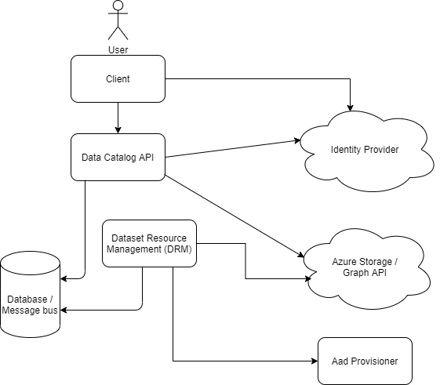

# Datacatalog API <!-- omit in toc --><!-- omit in toc -->
- [Purpose](#purpose)
- [Project Structure](#project-structure)
- [Architecture](#architecture)
- [Development](#development)
  - [Environment](#environment)
    - [Database](#database)
    - [Rebus](#rebus)
  - [Local](#local)
    - [Running Locally](#running-locally)
  - [Development/Test/Prod](#developmenttestprod)
  - [Implementation Details](#implementation-details)
    - [Azure Roles & Permissions](#azure-roles--permissions)
      - [DataCatalog.Api](#datacatalogapi)
      - [DataCatalog.DatasetResourceManagement](#datacatalogdatasetresourcemanagement)
    - [Storage](#storage)
    - [Identity Provider](#identity-provider)
  - [Migrations and Seeding](#migrations-and-seeding)
  - [Tests](#tests)
- [API Documentation](#api-documentation)
- [API Versioning](#api-versioning)
  - [Deprecating an API Version](#deprecating-an-api-version)
  - [Adding Documentation for a new API Version](#adding-documentation-for-a-new-api-version)
- [Kubernetes](#kubernetes)
  - [Migrator](#migrator)

## Purpose
The Data catalog api is a backend service for the [Data Catalog frontend](https://github.com/Open-Dataplatform/datacatalog-frontend) which can show various datasets and categories of those.
A dataset is conceptually a set of data points which has a number of properties attached to it. Among these we find an owner,
a category and a list of people which have some type of access to the data.

This project provides the skeleton for managing the datasets, but the data itself is not stored within the data catalog,
but rather is fetched and stored elsewhere (e.g. within Azure).

The backend service api can be used to define new datasets and categories of datasets along with multiple other metadata.
Furthermore it is responsible for controlling access to those datasets.

## Project Structure
There are multiple projects within the repository:
- DataCatalog.Api: The actual Api responsible for running the logic of managing datasets
- DataCatalog.Migrator: A command line tool able to run migrations and seeding the database when needed. Uses the Entity Framework as the migration tool. Seeding contains Energinet specific data.
- DataCatalog.Common: Shared code between the other projects
- DataCatalog.Common.Rebus: Shared code between projects which needs to utilize the Rebus message bus
- DataCatalog.Data: Models, DBContext and migrations used by Entity Framework. Contains Energinet specific data structures
- DataCatalog.Api.Messages: Messages that the data catalog api will publish
- DataCatalog.DatasetResourceManagement: Handles how dataset are provisioned
- DataCatalog.DatasetResourceManagement.Messages: Messages that the DRM will publish.

## Architecture
The DataCatalog.Api is the backbone of the backend. It handles all incoming API requests from the frontend and communicates to the database as well as Azure Graph API
and reads information directly from Azure storage. It also publishes messages - in particular when a new dataset is created. 
This message is then subscribed to by the DatasetResourceManagement (DRM) which will ensure that the dataset is provisioned by creating 
the required groups and give proper access to the azure storage folder via an external component named _Aad Provisioner_. Once provisioned, 
the DRM will publish a Dataset Provisioned message which is consumed by the API.

Both the API and DRM communicates with Azure's graph API to obtain information and modify information on the groups which has access to a particular dataset.

A client such as the one found in the repository [here](https://github.com/Open-Dataplatform/datacatalog-frontend) can be used to connect to the API and should 
be authenticated through the Identity Provider using the Authorization Code with PKCE flow. In order to access the API a user should be given one of the roles:

- User (view access to public datasets)
- DataSteward (editorial rights and access to internal datasets)
- Admin (Able to create and modify master data)



## Development

### Environment
Which environment is used on runtime is controlled by the environment variable _ASPNETCORE_ENVIRONMENT_.

The environment determines which particular appsettings.{_environment_}.json is used. Any values within this will override those within appsettings.json.
Furthermore the environment is included in the category, data contract and data source meta data.

#### Database
We currently assume an mssql database such as the managed mssql database one can acquire from Azure. 
If you would prefer another database, choose one that works with Entity Framework to avoid rewriting the entire DAL.

#### Rebus
We use Rebus as the messaging system. This works by utilizing the database as the message bus. 
Rebus has support for most popular databases, so choosing another for this purpose is easily done in the code. 
Look within the DataCatalog.Common.Rebus project.

### Local
To run the Api locally, you need to set the environment variable _ASPNETCORE_ENVIRONMENT_ to "Development". This will do the following:

- Disable all security requirements and allow anonymous access to the entire Api with all roles granted.
- Use a dummy implementation of IStorageService which always finds the path required and sets reader and write capabilities for that path.
- Use a dummy implementation of IGroupService which always returns the same local dummy user.
- Use a dummy middleware which ensures that the dummy user has a corresponding member within the database and sets the current user.
- Use dummy message handlers for messages out of the system. 

#### Running Locally
Since we want all services to communicate via the same database, we suggest you run the following docker image:

```powershell
docker run -e 'ACCEPT_EULA=Y' -e 'SA_PASSWORD=Test1234' -p 1433:1433 -d --name mssql mcr.microsoft.com/mssql/server:2017-CU8-ubuntu
```

Then modify the connection strings in appsettings.json for all projects needing access to the database to:

`Data Source=host.docker.internal,1433;Initial Catalog=Datacatalog;User Id=sa;Password=Test1234`

This includes the migrator project since you now want to run that project to create the database and the data foundation:
```powershell
cd src/DataCatalog.Migrator/; dotnet run
```

To launch the API from the command line run from the project root:
```powershell
cd src/DataCatalog.Api/; dotnet run
```

Alternatively all C# compatible IDE's should be able to load the project using the .sln file.

### Development/Test/Prod
The rest of the environments each have their own appsettings file, and will behave the same way otherwise with the one exception that 
running in development will allow all urls for CORS.

### Implementation Details

#### Azure Roles & Permissions
If you are using Azure as your cloud provider for storage, user manangement and Identity provider, then check this section 
for thorough documentation as to which roles various service principals should have.
Values listed in the below sections are Id's and secrets which should be provided to the application either through the appsettings,
or injected using a secrets provider such as Hashicorps Vault or Azure's KeyVault. Note that you should create different service principals 
for the Api and DRM respectively as this provides a more secure setup.

##### DataCatalog.Api
- `OAuth:Audience`: The audience is used by the OAuth2.0 protocol to determine if a token is valid or not. 
  Azure should contain a service principal (enterprise application) with an audience value of "api://{service-principal-id}". 
  The app registration for that service principal should be configured to allow SPA redirect-URI's towards the data catalog frontend,
  and should also be given any scopes that you deem necessary. 
  Finally, the app registration should have configured roles with the following values:
  - User
  - DataSteward 
  - Admin
  
  Remember that the roles should be given to either users or groups within the Enterprise application.
  It is also this service principal that the frontend should refer to as the access point for users.
- `GroupManagementClientId`: This Id refers to a service principal which is responsible for allowing access
to Microsoft Graph API. It is used to check user and group information.
- `GroupManagementClientSecret`: Matching secret for the service principal (created in the app registration).
- `DataLakeClientId`: App registration for accessing the DataLake storage account. The Api only requires read access since it 
  only needs to read meta data about the storage folders, so ensure that the app registration is given the role of _Storage Blob Data Reader_. 
- `DataLakeClientSecret`: Matching secret for the service principal.

##### DataCatalog.DatasetResourceManagement
- `GroupManagementClientId`: As for the Api, this id points towards a service principal which is responsible for doing group management.
  The difference is that the DRM assumes the presence of an external service which can help provision groups and service principals for datasets. 
  This is done via a HTTP call using a token obtained using this group management app registration. Thus the registration needs a secret 
  AND a scope for calling the external service. If you prefer to have the DRM to it all, cut the http calls, and instead provision in Azure within the DRM.
- `GroupManagementClientSecret`: Matching secret for the service principal (created in the app registration).
- `DataLakeClientId`: App registration for accessing the DataLake storage account. The DRM needs ownership in order to provision the storage folders properly,
  so ensure that it is given the role of _Storage Blob Data Owner_.
- `DataLakeClientSecret`: Matching secret for the service principal.

#### Storage
The only current implementation of a storage provider is using the Azure storage provider for storing data.
It uses Azure's own DataLakeServiceClient to access the data.

Creating a new implementation should be fairly straightforward. Just make a new implementation of the interface IStorageService
and configure it in Startup.cs instead of the azure version. Remember to disable azure setup by setting the AzureAD:Enabled to
false in the appsettings.json.

#### Identity Provider
Since we use the standardized OAuth2.0/OpenId Connect flow, you just have to configure the OAuth section in the appsettings.json
to your choice of Identity Provider. The only requirement is that the identity provider is able to provide role claims with the values of:
- User
- DataSteward
- Admin

### Migrations and Seeding
Generating and applying database migrations are handled by EF Core. The history is located at [src/DataCatalog.Data/](src/DataCatalog.Data/Migrations).

New migrations can be added using the [Entity Framework Core tools](https://docs.microsoft.com/en-us/ef/core/cli/dotnet) by running the following command from the root folder:

```powershell
dotnet ef migrations add NameOfMigration -p .\src\DataCatalog.Data\ -s .\src\DataCatalog.Api\
```

Applying migrations can be done either using the Entity Framework Core tools or by running the [DataCatalog.Migrator console app](src/DataCatalog.Migrator/README.md). In a production environment the migrator app is expected to run before the API is launched for every new release.


### Tests
Two test projects projects are present
- [tests/integration/DataCatalog.Api.IntegrationTests](tests/integration/DataCatalog.Api.IntegrationTests/)
- [tests/unit/DataCatalog.Api.UnitTests](tests/unit/DataCatalog.Api.UnitTests/)

These can be run using:
```powershell
dotnet test .\tests\integration\DataCatalog.Api.IntegrationTests\
dotnet test .\tests\unit\DataCatalog.Api.UnitTests\
```

## API Documentation
For documentation of API endpoints go to http://[DOMAIN]/swagger  
OpenAPI json can be found at http://[DOMAIN]/swagger/v[API-VERSION]/swagger.json

## API Versioning
Api versioning is done with [Microsoft.AspNetCore.Mvc.Versioning](https://github.com/microsoft/aspnet-api-versioning/wiki) as Http header based versioning.
Specifying a version via an Http Header using Api Versioning, allows urls to stay clean without cluttering them with version information.

| Http header   | Value |
|---------------|-------|
| x-api-version | 1.0   |

```
// This controller takes requests on version 1.0 and 1.1
[ApiVersion("1.0")]
[ApiVersion("1.1")]
public class DummyController : ControllerBase
{
	// this Action only replies on version 1.0
	[Route("")]
	[HttpGet]
	public async Task<IActionResult> GetV1_0()
	{
		return StatusCode(200, "Version 1.0");
	}
	
	// this action only replies on version 1.1
	[Route("Extra")]
	[HttpGet, MapToApiVersion("1.1")]
	public async Task<IActionResult> GetV1_1()
	{
		return StatusCode(200, "Version 1.1");
	}	
}
```
### Deprecating an API Version
To advertise that one or more API versions have been deprecated, simply decorate your controller with the deprecated API versions. A deprecated API version does not mean the API version is not supported. A deprecated API version means that the version will become unsupported after six months or more.


```
[ApiVersion( "2.0" )]
[ApiVersion( "1.0", Deprecated = true )]
[ApiController]
[Route( "api/[controller]" )]
public class HelloWorldController : ControllerBase
{
    [HttpGet]
    public string Get() => "Hello world!"

    [HttpGet, MapToApiVersion( "2.0" )]
    public string GetV2() => "Hello world v2.0!";
}
```
Resulting in a header named "api-deprecated-versions: 1.0" being sent in the response.

### Adding Documentation for a new API Version
Appending Swagger and openApi with new version is done by adding a new SwaggerDoc to options in the SwaggerExtensions class.

```
options.SwaggerDoc("v2.0", new OpenApiInfo
                {
                    Title = "DataCatalog.Api endpoint",
                    Version = "v2.0",
                    Contact = new OpenApiContact()
                    {
                        Name = "Dataplatform team",
                        Email = "dataplatform@energinet.dk"
                    }
                });
```

And adding a new swagger endpoint in the same SwaggerExtensions class.

```
	c.SwaggerEndpoint("/swagger/v2.0/swagger.json", "API v1.1");
```

## Kubernetes
Helm charts have been created to easily deploy to kubernetes. These are found within the chart folder.
Three docker images needs to be build in order to install the chart. This can achieved with the following commands:
``` bash
docker build -t datacatalog-backend . 
docker build -t datacatalog-migrator -f DataCatalog.Migrator.Dockerfile . 
docker build -t datacatalog-drm -f DataCatalog.DatasetResourceManagement.Dockerfile . 
```

To then deploy a release to kubernetes, run:

``` bash
helm install datacatalog-backend chart/ --set apiDeployment.image.repository="datacatalog-backend",job.image.repository="datacatalog-migrator",drmDeployment.image.repository="datacatalog-drm"
```

If you touch nothing, the chosen environment will be Development. 
The [Values](chart/values.yaml) file will indicate which values are available for configuration.

### Migrator
[Chart Hooks](https://helm.sh/docs/topics/charts_hooks/) are used to execute the migrator app as a Kubernetes Job before the API is started. This ensures that the database schema is up to date when deploying a new API version. Further it ensures that the migrations are only applied once even if the API is configured to have multiple replicas.